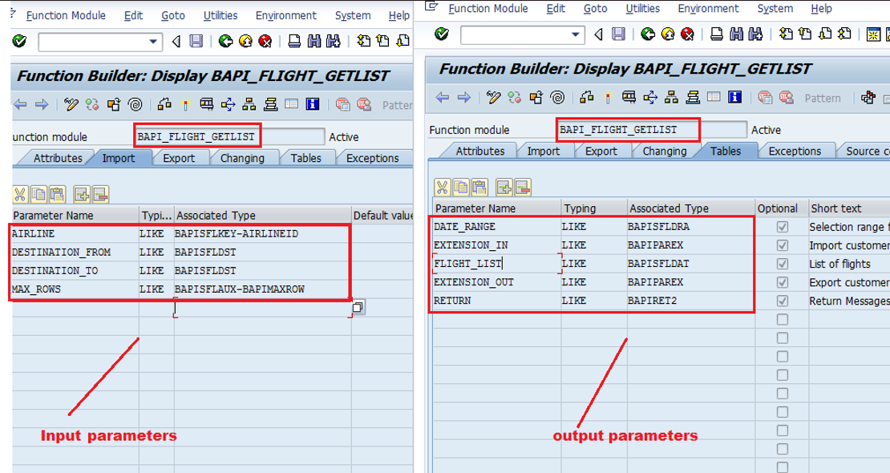

# Developing OData Service using BAPI with Mapping Technique

1. Go to `SE37` and analyse the BAPI ( For ex : BAPI_FLIGHT_GETLIST )
    - Recognize the input parameters of BAPI. ( Airline )
    - Recognize the output parameters of BAPI  ( Flight_List )

    

2. Go to `SEGW` Transaction code,  Create OData Service Project

3. Create Entity Type and EntitySet under Data Model folder
    1. Right Click on DataModel folder -> import -> DDIC Structure
    2. provide Entity Type name  =  Flight
    3. provide ABAP Structure    =  BAPISFLDAT ( import fields from this structure into odata service)
    4. select Checkbox To create EntitySet  = FlightSet
	5. click next	
	6. select required fields
	7. click next
	8. select atleast one field as key field  ( for ex : Airlineid )
	9. click finish

4. Define Mapping between OData Service and BAPI ( BAPI_FLIGHT_GETLIST )
    1. Expand Service Implementation Folder
    2. expand EntitySets ( FlightSet )
	3. right click on GETENTITYSET(  query )  option
	4. select "Map to DataSource" option
	5. provide Local
	6. Provide Data Source Type =  Remote Function Call
	7. Provide Data Source Name =  BAPI_FLIGHT_GETLIST
	8. click on  continue

    

    Define Input Mapping :

**To be continued
C:\Users\kvpra\Downloads\ClassNotes and Diagrams SAP Ui5 FIORI OData-20241116T012121Z-001\ClassNotes and Diagrams SAP Ui5 FIORI OData\ODataClass6**

