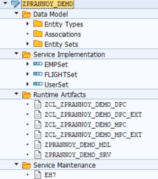
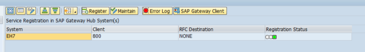
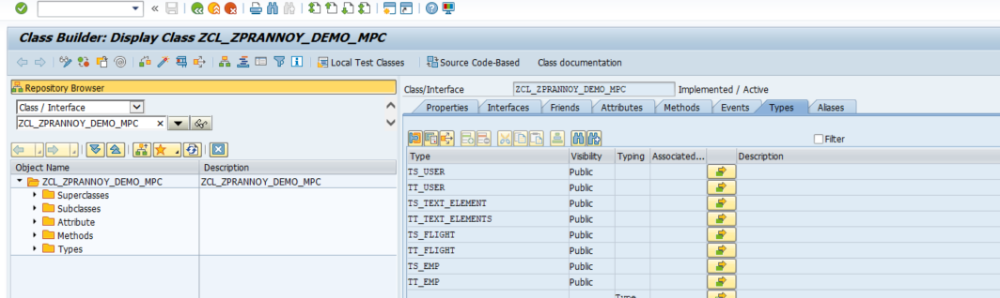
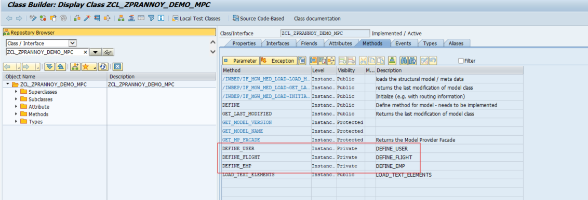
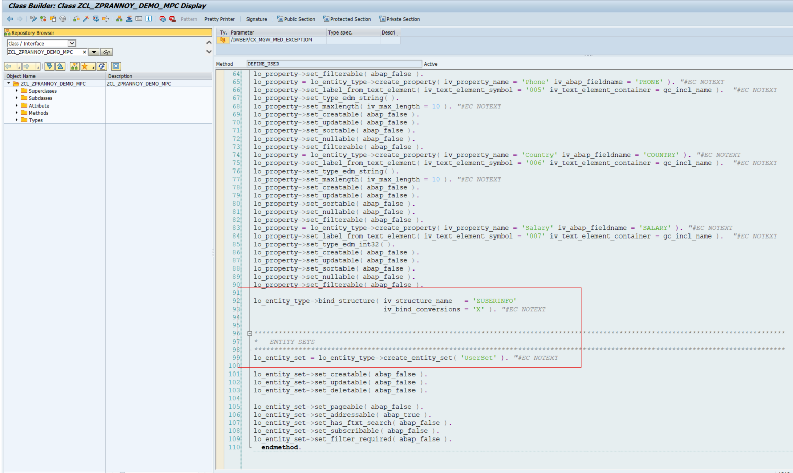
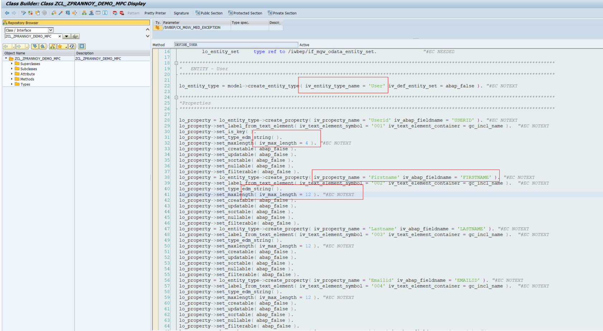
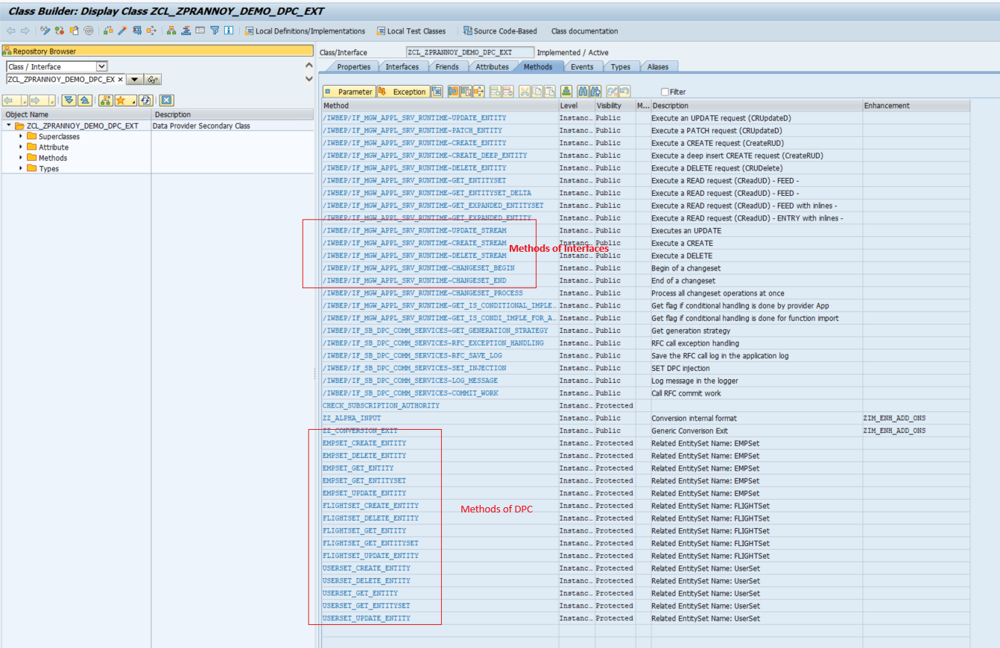
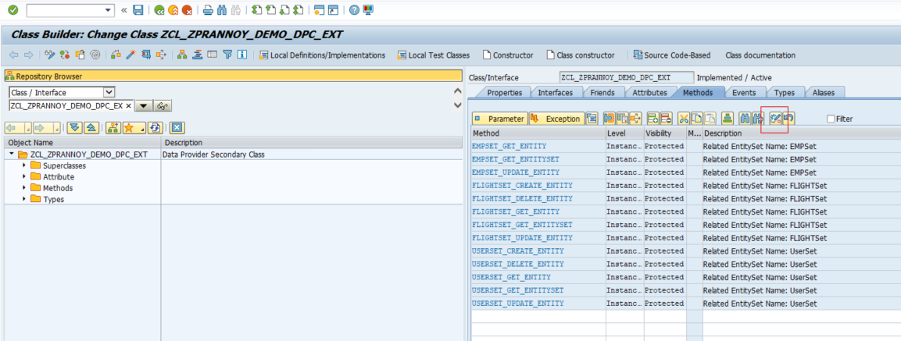
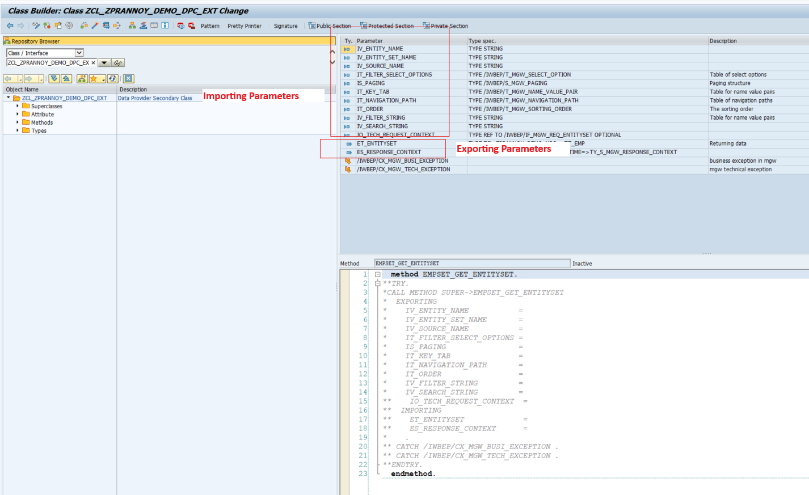

# ABAP Netweaver Gateway

## Fundamentals of OData Services :

OData Services are mainly for "Database Functionalities" ( SELECT, INSERT, DELETE, UPDATE )

OData Services are of 3 types :
- OData ABAP Service  : _for interaction with SAP ECC/CRM/SRM_
- OData HANA Service : _for interaction with SAP HANA_
- OData External Service : _for interaction with non-SAP_

`SEGW` is the TCode to build OData services in SAP Netweaver Gateway with ECC

All ABAP statement can be used in OData Service development except ABAP Screen related Statements. ABAP screen related statement cannot be used inside odata service development
because OData Service is meant for implementing only Database operations.

OData Service Project contains mainly four folders:-

- DataModel
- Service Implementation
- Runtime Artifacts
- Service Maintainence



Each of these folders are explained in detail below. 

#####  Data Model:-

- Entity:  _To hold single record at runtime. Entity is similar to "WORKAREA" in Normal ABAP._
- EntitySet: _To hold collection of record(s) at runtime. EntitySet is similar to "INTERNAL TABLE" in Normal ABAP_
- Entity Type: _To maintain Collection of Fields with it's DataType and length. EntityType is similar to "STRUCTURE" in Normal ABAP_
- Association: _Is the relationship between Two Entity Types._
- AssociationSet: _Is the relationship between Two EntitySets._

Under Single OData Service Project, we can have N Number of Entity Types and EntitySets

##### Service Implementation:-

Service Implementation mainly contains CRUD Methods for implementing Database operations

| Methods | Functionality | SAPUI5 Methods |
| ------ | ------ |------ |
| CREATE_ENTITY( ) |  INSERT  | create( ) |
| GET_ENTITY( ) | SELECT query ( 1 record ) | bindElement( ) |
| GET_ENTITYSET( ) | SELECT query ( N records) | bindRows() |
| UPDATE_ENTITY( ) | UPDATE | update( ) |
| DELETE_ENTITY( ) | DELETE |  remove( ) |

##### Runtime Artifacts:-

RunTimeArtifacts are technically collection of Classes for implementing database functionalities, which are generated after clicking 'Generate Runtime Artifacts' button
Few of the classes are as follows:-

- Model  Provider Class ( _MPC )
- Model Provider Extension Class ( _MPC_EXT )
- Data Provider Class ( _DPC )
- Data Provider Extension Class ( _DPC_EXT )
- Registered Service ( _SRV )
- Registered Model ( _MDL )

##### Service Maintainence:-



Service Maintainence folder allows us to do the following:-

- Error Log:- _To trace/find out errors which occured during odata service execution_
- Register:- _To register OData Service under SAP Netweaver Gateway component_
- Gateway Client:- _To Test OData Services_

For all Odata ABAP Services. The Service URL syntax is:-
`/sap/opu/odata/SAP/<OData_Project_Name>_SRV/`
- /sap/opu/odata ->   The service Path
- SAP -> Namespace
- <OData_Project_Name>_SRV -> OData Service Name

<br>

----

## Step by step procedure to create OData Service Project :-

1. Logon to SAP Netweaver Gateway with ECC backend using `SEGW` Transaction.
    1. Click on Create Project Icon
    2. Provide Project name
    3. Provide description
    4. Save it in package /local
    5. Continue
    
2. After Creating OData Service Project, by default we get below Folders:- 
    1. Data Model
    2. Service Implementation
    3. Runtime Artifacts
    4. Service Maintainence

3. Creation of Entity Type and EntitySet:-
        
    EntityType is collection of Fields with DataType and length
    EntitySet is used to hold collection of records at runtime
    1. Right click on "Data Model" folder  -> Import -> DDIC Structure
    2. Provide  EntityType name(Ex:- User)
    3. Provide corresponding ABAP structure(Ex:- ZUSERINFO)
    4. Provide/Select CheckBox to Create EntitySet(Ex:- ( UserSet )
    5. Continue
    6. Select Required Fields
    7. Continue
    8. Select atleast one Field as KeyField (Ex : Userid)
    9. Finish
    
4. Generate Runtime Artifacts:-
    1. Select OData Project Folder.
    2. Select Red color icon ( To generate Runtime Artifacts )
    3. Continue
    4. Save it in package/local
    5. Finish
    
    We get  below Classes on generating runtime artifacts
    1.  _MPC	
    2.  _MPC_EXT	
    3.  _DPC
    4.  _DPC_EXT
    5.  _MDL
    6.  _SRV

---

## About Model Provider Class ( MPC ) :-

- Model Provider Class registers "metadata" of OData Service as per DataModel section
    - Metadata here means:-
        - Name of EntityType
        - Name of EntitySet
        - Name of each Field with data type and length
        - Name of structure used for importing fields
        - TableStructure based on EntityType
        - TableType based on EntityType
- Model Provider Class should not be modified by Developer directly
- Model Provider Class is utilized by OData Framework to execute the functionality
- If we make any changes under 'Data Model' folder, we need to Re-generate Runtime Artifacts to make sure MPC Class is in sync with latest changes.


Table Types and Structures generated under MPC:- 

   

Methods generated to define our data model:-

   

How MPC links ABAP DDIC structure with Netweaver :-

   

How Data types and lengths are mapped in MPC:- 

   

---

## About Data Provider Class ( DPC ) :-

Data Provider Class is a Super Class for Data Provider Extension Class

Data Provider Extension class contains methods of Data Provider Class + methods of 1/many Interfaces + Methods created by Developer ( additionally if required ).

Syntax to utilize the Table Structure of MPC Class under DPC_EXT class for declaring Workarea
```
data: wa TYPE MPCCLASSNAME=>TS_EMP.
```

Syntax to refer to specific field of Table Structure:-
```
data: firstname Type MPCCLASSNAME=>TS_EMP-Firstname.

data: salary Type MPCCLASSNAME=>TS_EMP-Salary.
```

Syntax to utilize the Table Type of MPC CLass under DPC_EXT Class for declaring Internal Table
```
data: itab TYPE MPCCLASSNAME=>TT_EMP.
```

Few of the important methods of _DPC_EXT class that we will be dealing with are:- 

1. For major CRUD operations:-
    1. \<EntitySetName>_Create_Entity( )
    2. \<EntitySetName>_Get_Entity( )
    3. \<EntitySetName>_Get_EntitySet( )
    4. \<EntitySetName>_Update_Entity( )
    5. \<EntitySetName>_Delete_Entity( )

2. For other functionalities:-
    1. Create_Stream( )
    2. Update_Stream( )
    3. Get_Stream( )
    4. Execute_Action( )
    5. Get_Expanded_Entity( )
    6. Get_Expanded_EntitySet( ) and so on...



To implement any functionality under Any Method, we need to first "REDEFINE" that method.



Data Provider Extension CLass methods contains "method parameters".<br>
Method Parameters are responsible for exporting & importing data between SAP UI5/FIORI front-end app and OData Service




