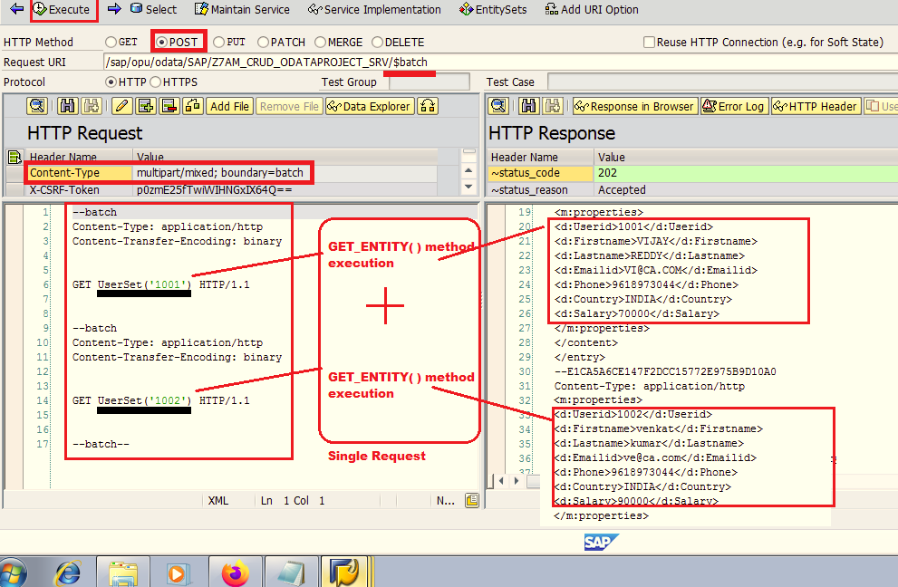

# Develop OData service to execute Multiple Methods/Operations in a Single Request.

Pre-requisites to Execute OData Service with batch technique:

1. Make sure that **_CHANGESET_BEGIN( )_** method is  REDEFINED with no code in it under DPC_EXT Class.
2. Make sure that  **_CHANGESET_END( )_** method is REDEFINED with no code in it under DPC_EXT Class.

These two methods will allow developers to execute OData Service with batch technique with no additional coding.


We just have to make sure that OData methods which will be used as part of the batch technique is implemented.( Ex- GET_ENTITY( ), GET_ENTITYSET( ) ect...)

---

### Testing:-

1. Open Gateway CLient and Test the service :

2. under HTTP Request -> Click on ( + ) add option and Provide
    - Content-Type multipart/mixed; boundary=batch
3.  Select POST
4. use Service URL as below
    - /sap/opu/odata/SAP/Z7AM_CRUD_ODATAPROJECT_SRV/$batch
    - And under HTTP Request Section, use below syntax and Execute the service

Scenario 1 :    
___________________________________________________
```
--batch
Content-Type: application/http
Content-Transfer-Encoding: binary

GET UserSet('1001') HTTP/1.1

--batch
Content-Type: application/http
Content-Transfer-Encoding: binary

GET UserSet('1002') HTTP/1.1

--batch--
```



Scenario 2 : 
________________________________________________
```
--batch
Content-Type: application/http
Content-Transfer-Encoding: binary

GET UserSet HTTP/1.1

--batch
Content-Type: application/http
Content-Transfer-Encoding: binary

GET FlightSet HTTP/1.1

--batch--
```
