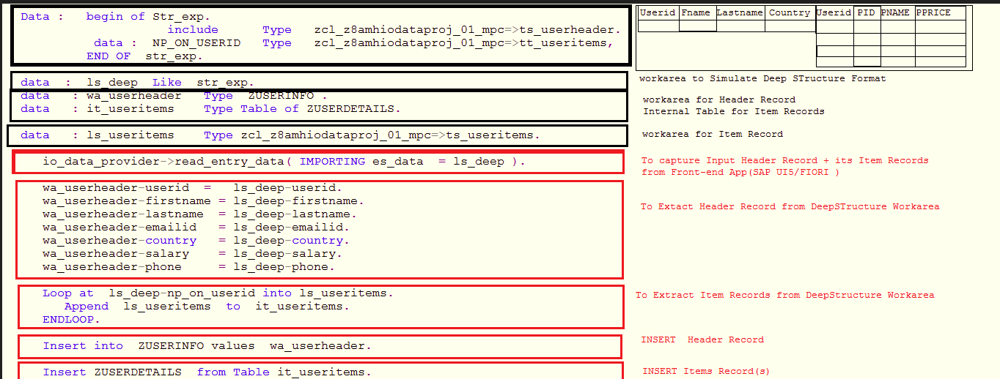
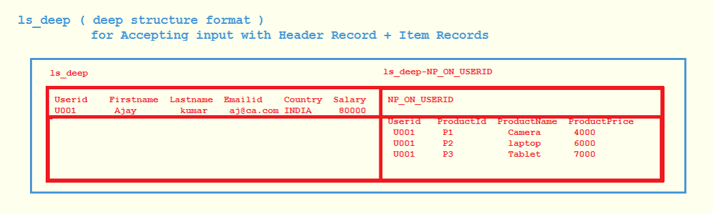
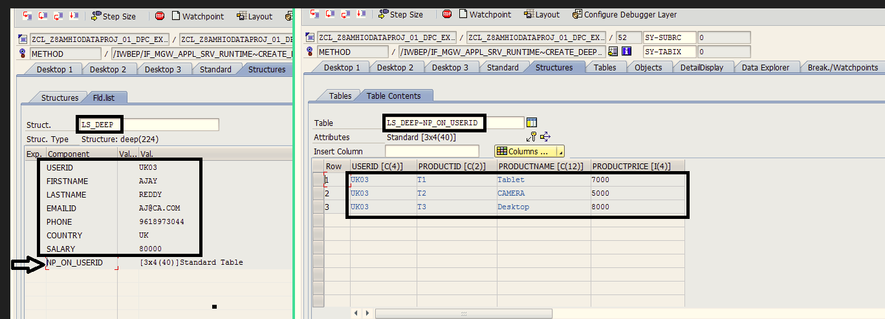

# Developing OData ABAP Service Using  CREATE_DEEP_ENTITY( ) method

CREATE_DEEP_ENTITY( ) :- _method is used to  INSERT Header Record along with Corresponding Item Records._

CREATE_DEEP_ENTITY( ) method contains 2 important parameters:- 
1. io_Data_Provider : _To accept Input Header Record along with its corresponding item records_
2. er_Deep_Entity : _(optional ) To send Output ( header + its Items )_

### Steps:- 

ZUSERINFO ( Table which contains  Header Records )

ZUSERDETAILS ( Table which contains Item Records )

Make sure that GET_EXPANDED_ENTITY( ) method is implemented.

REDEFINE CREATE_DEEP_ENTITY( ) method of Data Provider Extension Class ( DPC_EXT )

```
Data: Begin of Str_exp.
        include Type zcl_z8amhiodataproj_01_mpc=>ts_userheader.
        data: NP_ON_USERID Type zcl_z8amhiodataproj_01_mpc=>tt_useritems,
      End of  str_exp.

data: ls_deep Like str_exp.

data   : wa_userheader   Type  ZUSERINFO .
data   : it_useritems    Type Table of ZUSERDETAILS.
data   : ls_useritems    Type zcl_z8amhiodataproj_01_mpc=>ts_useritems.

io_data_provider->read_entry_data( IMPORTING es_data  = ls_deep ).

wa_userheader-userid  =   ls_deep-userid.
wa_userheader-firstname = ls_deep-firstname.
wa_userheader-lastname  = ls_deep-lastname.
wa_userheader-emailid   = ls_deep-emailid.
wa_userheader-country   = ls_deep-country.
wa_userheader-salary    = ls_deep-salary.
wa_userheader-phone     = ls_deep-phone.

Loop at  ls_deep-np_on_userid into ls_useritems.
    Append  ls_useritems  to  it_useritems.
ENDLOOP.

Insert into  ZUSERINFO values  wa_userheader.

Insert ZUSERDETAILS  from Table it_useritems.

```



### Testing:- 

1. open Service Maintainence -> open Gateway Client
    /sap/opu/odata/SAP/Z8AMHIODATAPROJECT1_SRV/USERHEADERSet(Userid='1001')?$expand=NP_ON_USERID

2. Select "GET" option and Execute The Service ( GET_EXPANDED_ENTITY( ) will be executed )

3. Now Select " USE AS REQUEST" option ( To Copy HTTP Response to HTTP Request )

4. Now under HTTP Request, Provide New Header and Item Record Values

5. From Service URL remove -> (Userid='1001')?$expand=NP_ON_USERID	

6. Select "POST" option and Execute The Service ( CREATE_DEEP_ENTITY( ) method will be executed )


