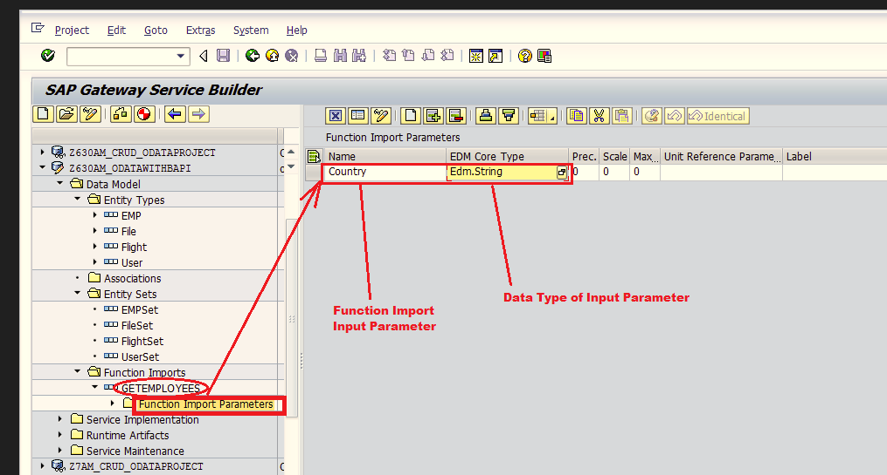
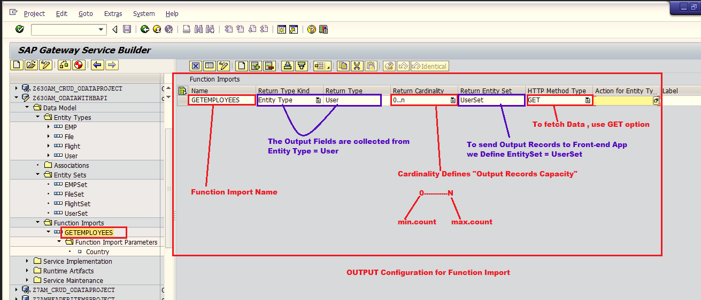
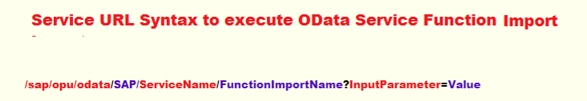

#  Developing OData ABAP Service with Function Import Concept using Execute_Action( ) method

Function Import  can deal with   GET , POST option

Function Import can be implement under  EXECUTE_ACTION( ) method

Execute_Action( ) method contains 3 important parameters
1. iv_Action_Name: will capture the name of the function triggered
2. it_parameter: will accept input value(s)
3. er_Data: will send output record(s)

## Steps

1. open You OData Service Project in SEGW tcode
2. Right Click on Data Model -> Create -> Function Import
    - provide Function Import Name  =   GETEMPLOYEES
    - continue
3. Define Input Configuration for Function Import:-
    - Expand  GETEMPLOYEES( function Import )
    - double click on  Function Import Parameters ( Folder )
    - click on  ( + )   to add Input Parameter with Data Type
        - Country -> Edm.String
    - Save
    
4. Define  Output Configuration for Function Import:-
    - Select GETEMPLOYEES ( Function Import Name )
    - configure as per below :
        - configure  Return Type Kind 	= EntityType
	    - configure  Return Type                 = User	
	    - configure Return Cardinality       =  0-N
	    - configure Return EntitySet          = UserSet
	    - configure HTTP Method Type     =  GET
    - Save
    
5. Generate Runtime Artifacts 

REDEFINE EXECUTE_ACTION( ) method of Data Provider Extension Class ( DPC_EXT )

```
Data :itab         	   Type  zcl_z630am_odatawithba_mpc=>tt_user.
Data :wa_parameter  Type  /iwbep/s_mgw_name_value_pair.

case  iv_action_name.
     WHEN  'GETEMPLOYEES'.
      Read Table it_parameter into wa_parameter with key name ='Country'.

       Select * from ZUSERINFO into
          CORRESPONDING FIELDS OF table  itab
          where  Country  = wa_parameter-value.

       copy_data_to_ref( EXPORTING  is_data  = itab
                         CHANGING    cr_data = er_data ).

   ENDCASE.
```

---

#### Testing URLS



/sap/opu/odata/SAP/Z630AM_ODATAWITHBAPI_SRV/GETEMPLOYEES?Country='US'

/sap/opu/odata/SAP/Z630AM_ODATAWITHBAPI_SRV/GETEMPLOYEES?Country='INDIA'