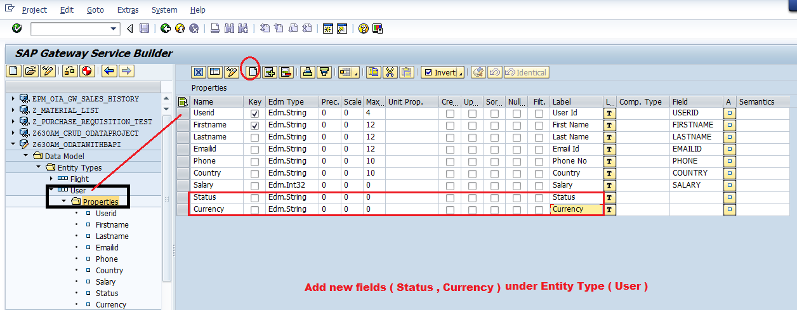
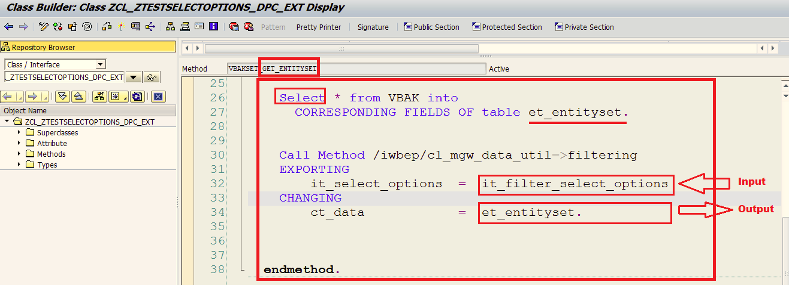
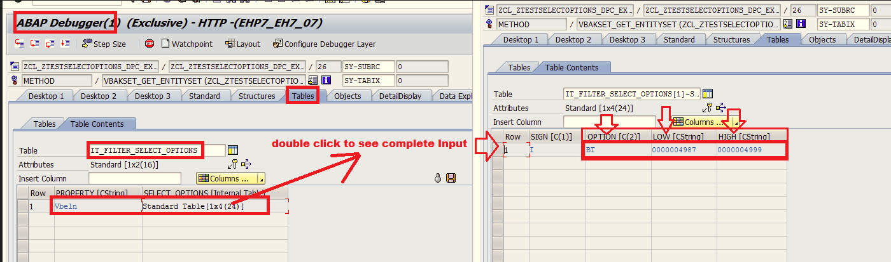

# Develop OData ABAP Service with GET_ENTITYSET( ) method

GET_ENTITYSET( ) method is used to send N Number of record(s).

GET_ENTITYSET( ) method contains 2 important parameters:-
1. iv_filter_string : _will accept input filter value(s)_
2. IO_TECH_REQUEST_CONTEXT : _will accept input Search String Value_
3. it_filter_select_options : _will accept Input Filter as Select Options_
4. et_entityset :  _will send output record(s)_


### Requirement 1: 

serviceURL/UserSet

serviceURL/UserSet?$filter=Userid eq '1001'

serviceURL/UserSet?$filter=Country eq 'INDIA'

serviceURL/UserSet?$filter=Country eq 'US'

serviceURL/UserSet?$filter=Salary gt  60000

serviceURL/UserSet?$filter=Country eq 'INDIA' and Salary gt  60000

### Requirement 2: 

Adding new Fields at Odata level and apply condition to populate values

#### step by step procedure :

1. open your OData Service Project under SEGW tcode
2. open Data Model -> Select  EntityTYpe ( User ) -> Remove ABAP Structure for User ( EntityType ) -> Save
3. select properties section of User ( EntityTYpe ) -> and add 2 new Fields and Save
    1. Status with Data Type Edm.String
    2. Currency	with Data Type Edm.String
    
4. Re-generate Runtime Artifacts
5. Open DataProvider Extension Class ( DPC_EXT )
5. REDEFINE UserSet_Get_EntitySet( )


### Code:- 

We "REDEFINE" the <entity_set>_GET_EntitySet( ) method of DataProvider Extension Class ( DPC_EXT ) Class

```
Data :    wa    TYPE     ZCL_Z630AM_ODATAWITHBA_MPC=>TS_USER.
  Data :   itab   TYPE    ZCL_Z630AM_ODATAWITHBA_MPC=>TT_USER.

  SELECT * from ZUSERINFO into
    CORRESPONDING FIELDS OF Table itab
    where (IV_FILTER_STRING).

    Loop at itab into wa.
      if wa-SALARY  >  80000.
         wa-STATUS  = 'EXPERIENCE EMP'.
      else.
         wa-STATUS  = 'FRESHER EMP'.
      Endif.

      if  wa-COUNTRY  = 'INDIA'.
          wa-CURRENCY = 'INDIAN RUPEE'.
       else .
          wa-CURRENCY = 'US DOLLAR'.
      Endif.

      Append   wa   to   ET_ENTITYSET.
    ENDLOOP.
```

----
---

### Requirement 3:- searchString concept using GET_ENTITYSET( )

For ex :

 serviceURL/EMPSet?search=*		Fetch and display All records

 serviceURL/EMPSet?search=VIJAY	Fetch and Display That specific record matching with VIJAY

 serviceURL/EMPSet?search=A*	Fetch and Display records matching with Firstname  with first letter  A

 serviceURL/EMPSet?search=K*	Fetch and display records matching with Firstname with first letter K

 serviceURL/EMPSet?search=K*N	Fetch and display records matching with Firstname with Firstletter K  & Ending letter N

 serviceURL/EMPSet?search=*A	Fetch and display records matching with Firstname with Ending Letter A


**Note:- Enduser can use  \*, but WHERE clause with LIKE operator under SELECT Query will respond only to % symbol so as a developer, we have to replace \*  with  %**

```
Data : searchstring TYPE STRING.

searchstring  = IO_TECH_REQUEST_CONTEXT->GET_SEARCH_STRING( ).

REPLACE all OCCURRENCES OF  '*' in SEARCHSTRING with '%'.

SELECT * from ZUSERINFO into
    CORRESPONDING FIELDS OF Table ET_ENTITYSET
    where FIRSTNAME LIKE searchstring.
```

---
---

### Requirement 3:- Select Options as Filter concept using GET_ENTITYSET( )

**/iwbep/CL_MGW_DATA_UTIL** Standard Class can be used with below static methods
1. Filtering  ( select options)
2. Orderby ( Sorting  )
3. Paging   ( Paging  )	


```
Select * From VBAK into
   	CORRESPONDING FIELDS OF table et_entityset.

Call method  /iwbep/cl_mgw_data_util=>filtering
   	 EXPORTING
   		  it_select_options   =  it_filter_select_options
 	   CHANGING
   		 ct_data             =  et_entityset.

```



Debugging it_filter_select_options:- 



#### Testing URLs:- 

/sap/opu/odata/SAP/Z630AMSOODATAPROJECT_SRV/VBAKSet?$filter=Vbeln ge '0000005000' and Vbeln le '0000005009'

/sap/opu/odata/SAP/Z630AMSOODATAPROJECT_SRV/VBAKSet?$filter=Vbeln ge '0000004967' and Vbeln le '0000004999'
