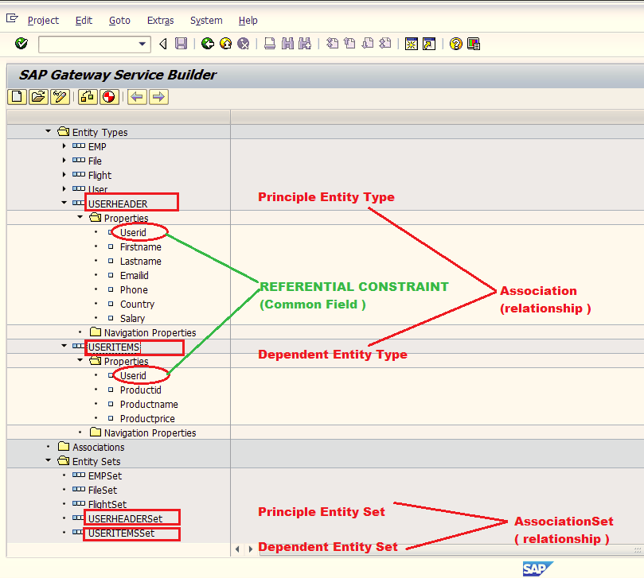
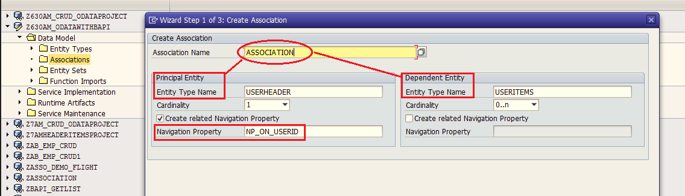
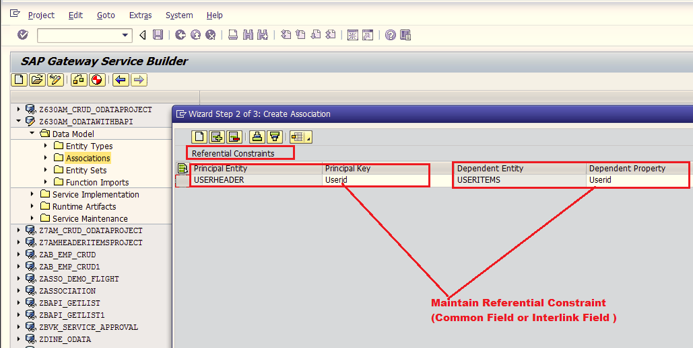
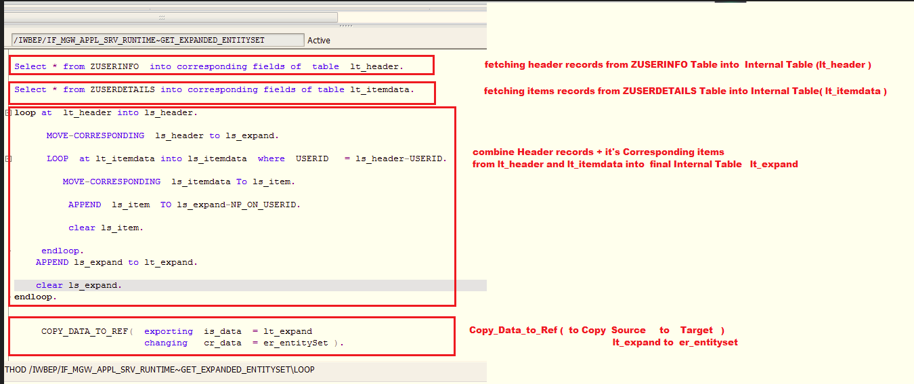

# # Develop OData ABAP Service to fetch Header records along with its corresponding Items

Following concepts are used when we fetch Header records along with its corresponding Items
- Principle Entity TYpe
- Dependent Entity TYpe

<br>

- Principle EntitySet
- Dependent EntitySet

<br>

- Association
- Association Set 

<br>

- Referential Constraint

<br>

- Navigation Property

<br>

Principle Entity Type : _Entity Type which maintains collection of Fields related to Header Data_

Dependent Entity TYpe: _Entity Type which maintains collection of Fields related to Item Data._

Principle Entity Set : _Entity Set which holds collection of Header Records_

Dependent Entity Set: _Entity Set which holds collection of Item Records for each Header record_

Association: _Association is the relationship between Principle Entity Type and Dependent Entity Type_

Association Set: _Association Set is the relationship between Principle EntitySet and Dependent EntitySet_

Referential Constraint : _The Common Field which is interlinked between Principle Entity Type and Dependent Entity Type_

Navigation Property: _Navigation Property is the option used to fetch Item data for each Header record using "expand" keyword under service URL_

`/sap/opu/odata/SAP/ServiceName/PrincipleEntitySet?$expand=<NavigationProperty>`

---

Whenever we want to fetch Header records and its corresponding Items either we can choose to use Association with Association Set or without it

If we use Association  with Association Set then we implement the code under one single method `GET_EXPANDED_ENTITYSET`

Without Association without Association Set we need to implement the code under two methods `PrincipleEntitySet_GET_ENTITYSET` and `DependentEntitySet_GET_ENTITYSET`

---

GET_EXPANDED_ENTITYSET( ) method contains 5 important parameters:-

1. iv_filter_string : _will accept Input value(s)_
2. iv_search_string : _will accept Input value(s)_
3. io_tech_request_context : _will accept Input value(s)_
4. it_filter_select_options	: _will accept Input value(s)_
5. er_entitySet	: _will send Output header records along with it's corresponding items._


### Steps:-

ZUSERINFO ( Table which contains  Header Records )

ZUSERDETAILS ( Table which contains Item Records )

1. Open Your OData Service Project under SEGW tcode
2. Under Data Model , create Entity Type & Entity Set  with ABAP Structure ( ZUSERINFO ) ( Userid is the Key field )
3.  Data Model, create Entity TYpe & Entity Set with ABAP Structure ( ZUSERDETAILS ) ( Userid is the Key field )

4. Create Association,  Maintain Referential Constraint , Create Association Set:-
    - **Creating Association**
        - Expand Data Model Folder -> Right Click on "Associations"  Folder - > click on Create option
        - Configure  Association Name  = Association
        - configure Priniciple  Entity Type  = USERHEADER with Cardinality ( 1 )
        - configure  Dependent Entity Type = USERITEMS   with Cardinality ( 0-N )
        - Configure Navigation property  =  NP_ON_USERID
        - click next
        
    - **Maintain Referential Constraint**
        - left side  -> Configure   Userid   For ( USERHEADER  )
        - right side -> Configure  Userid  For ( USERITEMS )
        - click next
        
    - **Create Association Set**
        - Provide AssociationSet Name  = AssociationSet
        - left side  ->configure Principle Entity Set = USERHEADERSet
        - right side -> Configure Dependent Entity Set = USERITEMSSet
        - click Finish
5. Generate Runtime Artifacts 


REDEFINE GET_EXPANDED_ENTITYSET( ) method of Data Provider Extension Class ( DPC_EXT ).

```
DATA :  Begin of T_EXPAND.
            INCLUDE  TYPE   zcl_z630am_odatawithba_mpc=>TS_USERHEADER.
            DATA :  NP_ON_USERID  TYPE zcl_z630am_odatawithba_mpc=>TT_USERITEMS,
        end of  T_expand.

data  lt_expand LIKE TABLE oF T_EXPAND.
data  ls_expand LIKE T_EXPAND.

data : lt_header TYPE TABLE of ZUSERINFO,
       ls_header TYPE ZUSERINFO.

data :  lt_itemdata TYPE TABLE OF ZUSERDETAILS,
        ls_itemdata TYPE ZUSERDETAILs.

data : ls_item type zcl_z630am_odatawithba_mpc=>TS_USERITEMS.

CONSTANTS :  lc_expand_tech_Clause TYPE STRING value 'NP_ON_USERID'.

Select * from ZUSERINFO  into corresponding fields of table lt_header.

Select * from ZUSERDETAILS into corresponding fields of table lt_itemdata.

loop at lt_header into ls_header.

      MOVE-CORRESPONDING  ls_header to ls_expand.

      LOOP at lt_itemdata into ls_itemdata where USERID = ls_header-USERID.

         MOVE-CORRESPONDING ls_itemdata To ls_item.

          APPEND ls_item TO ls_expand-NP_ON_USERID.

          clear ls_item.

     endloop.
    APPEND ls_expand to lt_expand.

    clear ls_expand.
endloop.


COPY_DATA_TO_REF( exporting  is_data  = lt_expand
                  changing   cr_data  = er_entitySet ).


INSERT lc_expand_tech_Clause into table ET_EXPANDED_TECH_CLAUSES.

```

#### Logic Description of GET_EXPANDED_ENTITYSET( ) method:-
- Fetch header records from ZUSERINFO Table into  Internal Table (lt_header )
- Fetch items records from ZUSERDETAILS Table into Internal Table( lt_itemdata )
- combine Header records + it's Corresponding items from lt_header and lt_itemdata into  final Internal Table lt_expand
- Copy data to ref ( from source to Target  )
	i.e.. from lt_expand to er_entitySet
- Finally  er_entitySet will send output (header records + its items ) to Front-end App


---

#### Testing

Select  "GET" option  and select EntitySets ( USERHEADERSet )  

/sap/opu/odata/SAP/Z630AM_ODATAWITHBAPI_SRV/USERHEADERSet?$expand=NP_ON_USERID

/sap/opu/odata/SAP/Z630AM_ODATAWITHBAPI_SRV/USERHEADERSet?$expand=NP_ON_USERID&$format=json


