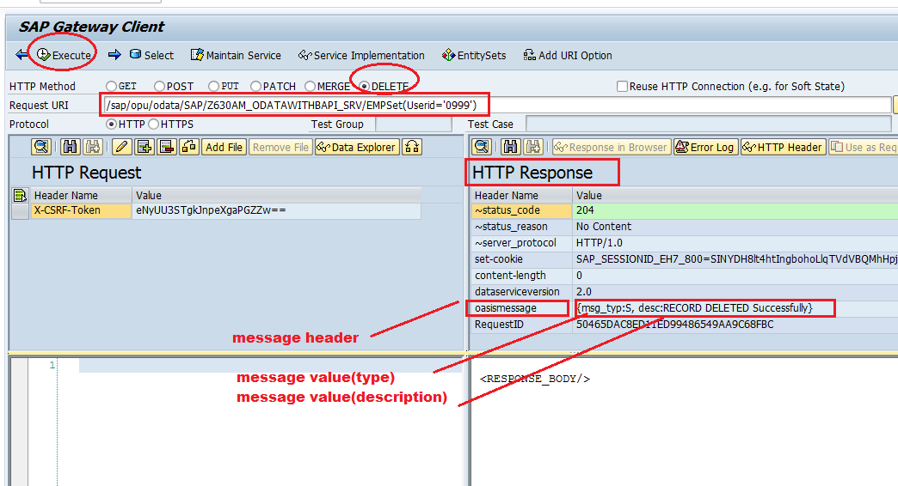

# Set HTTP Headers

HTTP Header contains  2 options
- header name  = provide header name
- header value  = provide message Type and message description

```
DATA:ls_header TYPE ihttpnvp.

ls_header-name = 'OASISMESSAGE'.

ls_header-value = '{msg_typ:S, desc:RECORD inserted successfully}'.

/iwbep/if_mgw_conv_srv_runtime~set_header( ls_header ).
```

Sample code for _DELETE_ENTITY( ) method:- 

```
DATA:ls_header TYPE ihttpnvp.

ls_header-name = 'OASISMESSAGE'.

Data : WA_KEY_Tab   TYPE  /IWBEP/S_MGW_NAME_VALUE_PAIR.

Read Table  IT_KEY_TAB  into  WA_KEY_TAB  index 1 .

DELETE from ZUSERINFO where  Userid = WA_KEY_TAB-VALUE.

if sy-subrc  = 0.
   ls_header-value = '{msg_typ:S, desc:RECORD DELETED Successfully}'.
else.
   ls_header-value = '{msg_typ:E, desc:RECORD NOT DELETED}'.
endif.

/iwbep/if_mgw_conv_srv_runtime~set_header( ls_header ).
```

We will get message under HTTP Response section 

