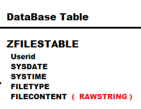
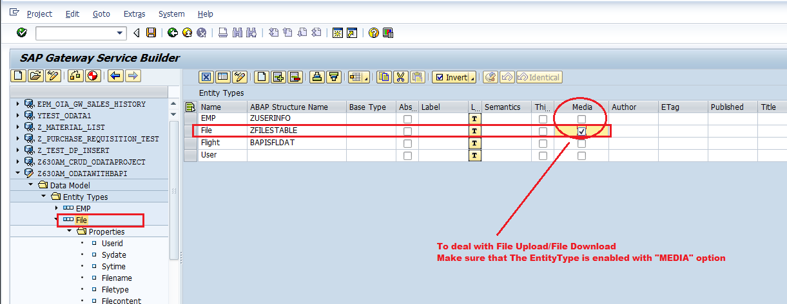

# Developing OData ABAP Service for File Upload and File Download

For File Upload, we can use UPDATE_STREAM( ) method<br>
For File Download, we can use GET_STREAM( ) method

UPDATE_STREAM( ) method contains 2 important parameters
1. it_key_tab: _will accept input key Field Value(s)_
2. is_media_resource: _will accept Input File Type & Input File Content_

GET_STREAM( ) method contains 2 important parameters
1. it_key_tab: _will accept input key Field Value(s)_
2. er_stream: _will send output File Type & Output File Content_

## Standard Structure to deal with File Type and File Content

**TY_S_MEDIA_RESOURCE** standard structure contains 2 options
1. MIME_TYPE ( deals with File Type )
2. VALUE ( deals with File Content )

**Note:- File Content is store under Database Table as _Rawstring_ Data Type Field**


1. open your OData ABAP Service Project under SEGW tcode
2. Under Data Model , create Entity Type , EntitySet with ABAP structure =  ZFILESTABLE
    - Right Click DataModel -> import ->DDIC structure
    - Provide  EntityTYpe name  = File
    - provide ABAP structure  =  ZFILESTABLE
    - Select checkbox to create EntitySet  ( FileSet )
    - click next
    - select the fields
    - click next
    - Select KeyField ( for ex : Userid )
    - click finish
3. Select Your EntityType ( File )  and Enable **"MEDIA"** option -> save
    
4. Re-generate Runtime Artifacts

REDEFINE UPDATE_STREAM(  ) method in DataProvider Extension Class ( DPC_EXT )

```
Data :  wa_key_tab  TYPE  /iwbep/s_mgw_name_value_pair.
Data :  wa          Type  zcl_z630am_odatawithba_mpc=>ts_file.

Read Table  it_key_tab  into  wa_key_tab  index 1.

wa-userid      = wa_key_tab-value.
wa-sydate      = sy-datum.
wa-sytime      = sy-uzeit.
wa-filetype    = is_media_resource-mime_type.
wa-filecontent = is_media_resource-value.

INSERT into ZFILESTABLE Values  WA.
```

------------

REDEFINE GET_STREAM(  ) method in DataProvider Extension Class ( DPC_EXT )

```
Data : Wa_key_tab  TYPE  /IWBEP/S_MGW_NAME_VALUE_PAIR.
Data : wa          TYPE  zcl_z630am_odatawithba_mpc=>ts_file.
Data : wa_stream   TYPE  ty_s_media_resource.

READ TABLE it_key_tab into wa_key_tab index 1.

Select single * from ZFILESTABLE into
    CORRESPONDING FIELDS OF wa
    where Userid  =  wa_key_tab-value.

  wa_stream-mime_type = wa-filetype.
  wa_stream-value  = wa-filecontent.

  copy_data_to_ref( EXPORTING  is_data  = wa_Stream
                    CHANGING   cr_data   = er_Stream ).
```

----
----

#### Testing using Gateway Client:-

##### File Upoad Functionality :

1. Open Service Maintainence -> Goto  Gateway Client
2. select Entity Set (  FileSet )
3. provide below URL syntax and Select PUT operation
    /sap/opu/odata/SAP/Z630AM_ODATAWITHBAPI_SRV/FileSet('G800')/$value
    /sap/opu/odata/SAP/Z630AM_ODATAWITHBAPI_SRV/FileSet('G801')/$value
4. Add File ( from desktop to http request )
5. execute the service

When we use PUT option with $value in the above URL's ,Then automatically  UPDATE_STREAM( ) is executed

##### File Download Functionality :

1. Instead of PUT, this time select GET method

    /sap/opu/odata/SAP/Z630AM_ODATAWITHBAPI_SRV/FileSet('G800')/$value
    /sap/opu/odata/SAP/Z630AM_ODATAWITHBAPI_SRV/FileSet('G801')/$value

2. Execute the service

When we use GET option with $value in the above URL's ,Then automatically GET_STREAM( ) is executed


